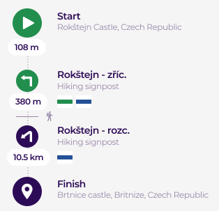

# Routes requests (30) 

````json
{
    "id": "1",
    "cover": "http://127.0.0.1/album/lorem.png",
    "title": "Lorem Ipsum is simply dummy text of the printing",
    "description": "Lorem Ipsum has been the industry's standard dummy text",
    "distance": "2650",
    "publicated": "false",
    "tags": [ "1", "2" ],

    "places":
    [
        {
            "id": "1",
            "title": "Lorem ipsum",
            "tag": "2"
        }
    ],

    "album":
    [
        "http://127.0.0.1/album/1.png",
        "http://127.0.0.1/album/2.png"
    ],

    "track":
    [
        {
            "id": "1",
            "title": "Lorem Ipsum",
            "description": "industry's standard dummy",
            "lon": "16.52529090642929",
            "lat": "49.22410972416401",
            "direction": "1",
            "distance": "380",
            "sings":
            [
                {
                    "id": "1"
                }
            ]
        }
    ]
}
````

- **id** - defines indentificator of the current item
- **cover** - defines link to cover picture for the item
- **title** - defines title of the item which is limited by 98 bytes. This item is translatable on the server
- **description** - defines description of the item. This item is translatable on the server
- **distance** - defines distance of the route in metres
- **tags** - defines contained tags
- **places** - defines contained places which you may meet on the way. See also: [places](__places)
- **album** - defines contained pictures for the item
- **track** - defines GPS track. It containts key points of the route
    - **id** - defienes order of the point. Id which equels *1* is always "Start" of the route
    - **title** - defines title of the GPS point. This field is not translatable and limited by 32 bytes
    - **description** - defines short description for the GPS point. This field is not translatable and limited by 54 bytes
    - **lon** - defines longitude of the GPS point
    - **lat** - defines latitude of the GPS point
    - **direction** - defines an icon for showing direction. See also: [directions](__route?id=directions)
    - **distance** - defines length between two GPS point: this point and the next one
    - **sings** - defines addition information about the point. See also: [signs](__route?id=sings)

### Directions
Directions show tips for users about what way the traveler should go next after a checkpoint which he rechied. Example for directions of the GPS track is below:

<p style='text-align: center;'> </p> 

An editor may choose one of the directions for each checkpoint:

1. Straight (0 degrees)
1. Turn left (~ -90 degrees)
1. Keep left (> -90 degrees)
1. Sharp left (< -90 degrees)
1. Turn right (~ 90 degrees)
1. Keep right (< 90 degrees)
1. Sharp right (> 90 degrees)

Numbers of the enumeration mathes with ID of direction

### Sings

**Signs** - additional information for a tourist about checkpoints. It may be any signs which can help to choose a correct way to reach a next checkpoint, for example: tourist signs, plates with titles of cities and etc.